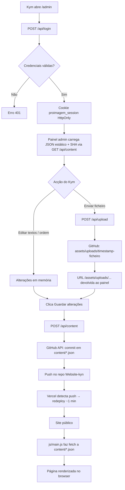

# Proimagem.pt — Checklist do Projeto

Documento de referência para o Kym (cliente) e para o programador. Atualizado com base no estado actual do repositório `Daniel-WorkTi/Website-kyn`.

---

## 1. Contexto completo do projecto

### O que é

Site institucional e portfólio da **Proimagem.pt** — produção audiovisual (Multicam, Aftermovie, Photography, FPV/Drone, Social Media, Studio Space, equipa e parceiros).

O conteúdo (textos, fotos, vídeos, ordem das galerias) é **editável pelo Kym** através de um painel web em português, sem necessidade de GitHub, código ou base de dados.

### Stack técnica

| Camada | Tecnologia |
|---|---|
| Frontend público | HTML estático + CSS (`css/style.css`) + JavaScript vanilla (`js/main.js`) |
| Conteúdo | Ficheiros JSON em `content/` |
| Painel admin | `admin/index.html` + `admin/admin.js` + `admin/admin.css` |
| API serverless | Funções Vercel em `api/` (login, sessão, conteúdo, upload) |
| Autenticação | Cookie HttpOnly assinado com HMAC (`lib/auth.js`) |
| Persistência | GitHub API → repositório `Daniel-WorkTi/Website-kyn`, branch `main` |
| Hosting | Vercel (deploy automático a cada push no GitHub) |
| Base de dados | **Não existe** (ver secção 3) |

### URLs importantes

| Recurso | URL |
|---|---|
| Site público | https://website-kyn.vercel.app |
| Painel de gestão | https://website-kyn.vercel.app/admin |
| Repositório GitHub | https://github.com/Daniel-WorkTi/Website-kyn |
| Marca / domínio alvo | Proimagem.pt (domínio personalizado pode ser configurado no Vercel) |

### Páginas do site

| Página | Ficheiro JSON | HTML |
|---|---|---|
| Home | `content/site.json` | `index.html` |
| Studio Space | `content/galleries/studio-space.json` | `studio-space.html` |
| Multicam | `content/galleries/multicam.json` | `multicam.html` |
| Aftermovie | `content/galleries/aftermovie.json` | `aftermovie.html` |
| Photography | `content/galleries/photography.json` | ⚠️ `photography.html` **em falta** |
| FPV/Drone | `content/galleries/fpv-drone.json` | `fpv-drone.html` |
| Social Media | `content/galleries/social-media.json` | `social-media.html` |
| Equipa | `content/team.json` | `team.html` |
| Parceiros | `content/partners.json` | `parceiros.html` |

### Estado actual do conteúdo

- A maior parte das imagens e vídeos ainda apontam para URLs externas (`supdmick.com`) — legado da exportação do site anterior.
- Fotos da equipa e logótipos dos parceiros estão vazios (`""`).
- Links de redes sociais no `site.json` estão vazios.
- A pasta `assets/uploads/` será criada automaticamente no primeiro upload pelo painel.

---

## 2. Diagrama de arquitectura (fluxo de dados)



### Resumo do fluxo

1. **Login** — O Kym autentica-se com `ADMIN_USERNAME` / `ADMIN_PASSWORD`. O servidor cria um token de sessão (7 dias) guardado num cookie seguro.
2. **Leitura** — O painel lê os JSON directamente do site (`/content/...`) e obtém o `sha` do GitHub via `/api/content?path=...` para evitar conflitos ao guardar.
3. **Upload** — Ficheiros até 4 MB são enviados em base64 para `/api/upload`, que faz commit em `assets/uploads/` no GitHub.
4. **Gravação** — Ao guardar, `/api/content` faz commit do JSON actualizado em `content/` no GitHub.
5. **Publicação** — O Vercel redeploya automaticamente. O site público (`js/main.js`) carrega os JSON actualizados com `cache: no-store`.

---

## 3. Existe base de dados?

### **NÃO.**

Não há PostgreSQL, MongoDB, Supabase, Firebase nem qualquer outro serviço de base de dados.

| O quê | Onde fica | Como funciona |
|---|---|---|
| Textos, listas, URLs de media | Ficheiros `.json` em `content/` | Commitados no GitHub; servidos como ficheiros estáticos pelo Vercel |
| Imagens e vídeos enviados pelo painel | `assets/uploads/` no repositório | Commitados no GitHub via API; servidos como ficheiros estáticos em `https://website-kyn.vercel.app/assets/uploads/...` |
| Credenciais do admin | Variáveis de ambiente no Vercel | Nunca ficam no código nem no GitHub |
| Token GitHub | Variável `GITHUB_TOKEN` no Vercel | Usado só pelo servidor para escrever no repo |
| Sessão do Kym | Cookie `proimagem_session` no browser | Token assinado com `SESSION_SECRET`; não persiste em disco |

**Vantagem:** simplicidade, histórico completo no Git, zero custos de BD.  
**Limitação:** cada alteração gera um commit + redeploy; não é ideal para sites com milhares de edições por hora.

---

## 4. Para onde vão os uploads

```
Repositório GitHub (Daniel-WorkTi/Website-kyn)
└── assets/
    └── uploads/
        ├── 1720123456789-foto.jpg
        ├── 1720123456790-video.mp4
        └── ...
```

| Etapa | Detalhe |
|---|---|
| Destino no repo | `assets/uploads/{timestamp}-{nome-sanitizado}` |
| API responsável | `POST /api/upload` (`api/upload.js`) |
| Sanitização | Nome do ficheiro reduzido a `[a-zA-Z0-9._-]`, minúsculas |
| URL pública | `/assets/uploads/1720123456789-foto.jpg` → servida pelo Vercel como ficheiro estático |
| Referência no JSON | O painel grava esta URL relativa no campo `src`, `poster`, `photo` ou `logo` do JSON correspondente |

> A pasta `assets/uploads/` pode não existir no repo até ao primeiro upload. O GitHub cria-a automaticamente no primeiro commit.

---

## 5. Variáveis de ambiente (Vercel)

Configurar em **Vercel → Project → Settings → Environment Variables**. Após alterar, fazer **Redeploy**.

| Estado | Variável | Obrigatória | Descrição |
|:---:|---|---|---|
| [ ] | `ADMIN_USERNAME` | Sim | Utilizador do painel `/admin` |
| [ ] | `ADMIN_PASSWORD` | Sim | Palavra-passe forte (mín. 12 caracteres recomendado) |
| [ ] | `SESSION_SECRET` | Sim | String aleatória com 32+ caracteres para assinar cookies de sessão |
| [ ] | `GITHUB_TOKEN` | Sim | Personal Access Token do GitHub com permissão **repo** (leitura + escrita) no repositório `Website-kyn` |

### Como criar o `GITHUB_TOKEN`

1. GitHub → **Settings → Developer settings → Personal access tokens**
2. **Generate new token (classic)** ou fine-grained com acesso ao repo `Daniel-WorkTi/Website-kyn`
3. Permissão: **repo** (contents: read and write)
4. Copiar o token e colar em `GITHUB_TOKEN` no Vercel
5. Redeploy

> O Kym **nunca vê** o `GITHUB_TOKEN`. Só o servidor Vercel usa.

---

## 6. Checklist do cliente (Kym) — passo a passo

### Primeira vez

- [ ] Receber **utilizador** e **palavra-passe** do programador (não partilhar por canais inseguros)
- [ ] Abrir https://website-kyn.vercel.app/admin
- [ ] Entrar com as credenciais
- [ ] Confirmar que vês o painel com a barra lateral (Página Inicial, Studio Space, etc.)

### Editar conteúdo (uso diário)

- [ ] Escolher a secção na barra lateral esquerda
- [ ] Ver o conteúdo tal como aparece no site (pré-visualização integrada)
- [ ] **Textos:** editar campos directamente (título, subtítulo, nomes, funções, etc.)
- [ ] **Imagens/vídeos:** arrastar ficheiros para a zona de drop **ou** clicar numa imagem existente para substituir
- [ ] **Reordenar:** usar os controlos de ordem nas galerias (quando disponíveis)
- [ ] **Remover:** apagar items que já não são necessários
- [ ] Verificar o indicador «Alterações por guardar»
- [ ] Clicar **Guardar alterações**
- [ ] Aguardar ~1 minuto e abrir o site público para confirmar (Ctrl+F5 / Cmd+Shift+R para refrescar sem cache)

### Upload de ficheiros

- [ ] Formatos: imagens (JPG, PNG, WebP…) e vídeos (MP4)
- [ ] Tamanho máximo: **4 MB por ficheiro**
- [ ] Se o ficheiro for maior: comprimir antes (ver secção 8)
- [ ] Após upload, o ficheiro fica automaticamente ligado ao item; **não esquecer de Guardar alterações**

### Sessão e segurança

- [ ] A sessão dura 7 dias; depois é preciso entrar outra vez
- [ ] Usar **Sair** quando terminar num computador partilhado
- [ ] Para mudar a palavra-passe: pedir ao programador para actualizar `ADMIN_PASSWORD` no Vercel

### Verificar publicação

- [ ] Clicar «Ver site ↗» no canto superior do painel
- [ ] Confirmar que fotos, vídeos e textos reflectem as alterações
- [ ] Se algo não aparecer: esperar mais 1–2 minutos (redeploy Vercel) e refrescar

---

## 7. Checklist do programador

### Concluído ✅

- [x] Site estático data-driven (`js/main.js` lê `content/*.json`)
- [x] Páginas HTML para Home, Studio Space, Multicam, Aftermovie, FPV/Drone, Social Media, Equipa, Parceiros
- [x] Estrutura JSON para todas as secções (`content/site.json`, galerias, team, partners)
- [x] Painel admin visual em português (`admin/`)
- [x] API de login com cookie HttpOnly (`api/login.js`)
- [x] API de sessão e logout (`api/session.js`, `api/logout.js`)
- [x] API de conteúdo com leitura/escrita via GitHub (`api/content.js`)
- [x] API de upload para `assets/uploads/` (`api/upload.js`)
- [x] Biblioteca de autenticação com comparação timing-safe (`lib/auth.js`)
- [x] Configuração Vercel básica (`vercel.json`: cleanUrls, trailingSlash)
- [x] Guia para o Kym (`GUIA-CMS.md`)
- [x] Deploy no Vercel (website-kyn.vercel.app)

### Pendente ⏳

- [ ] Confirmar que as 4 variáveis de ambiente estão configuradas no Vercel de produção
- [ ] Criar `photography.html` (referenciado na navegação mas em falta no repo)
- [ ] Migrar media de `supdmick.com` para `assets/uploads/` (via painel ou script)
- [ ] Preencher fotos da equipa (`content/team.json` — campos `photo` vazios)
- [ ] Preencher logótipos dos parceiros (`content/partners.json` — campos `logo` vazios)
- [ ] Configurar links de redes sociais (`content/site.json` → `socials`)
- [ ] Configurar domínio personalizado `proimagem.pt` no Vercel (se aplicável)
- [ ] Remover ficheiros legados não usados (`api/auth.js`, `api/callback.js`, `admin/config.yml` — restos de CMS anterior)
- [ ] (Futuro) Integrar Cloudinary para vídeos pesados > 4 MB

### Testes recomendados antes de entregar ao Kym

- [ ] Login com credenciais correctas / incorrectas
- [ ] Upload de imagem < 4 MB → aparece no site após guardar + redeploy
- [ ] Upload de ficheiro > 4 MB → mensagem de erro clara
- [ ] Editar e guardar cada secção do painel
- [ ] Logout e re-login
- [ ] Sessão expirada (cookie inválido) → redirect para login
- [ ] Site público renderiza correctamente em mobile

---

## 8. Limitações conhecidas

| Limitação | Detalhe | Solução |
|---|---|---|
| **Upload máximo 4 MB** | Limite imposto em `api/upload.js` (`MAX_BYTES = 4 * 1024 * 1024`) e reforçado no painel (`admin/admin.js`). Também alinhado com limites de body das funções Vercel. | Comprimir imagens (TinyPNG, Squoosh) e vídeos (HandBrake, FFmpeg) antes de enviar |
| **Vídeos pesados** | Vídeos de aftermovie/drone podem facilmente exceder 4 MB | Comprimir para MP4 H.264; ou integração futura com **Cloudinary** (CDN + transformações) |
| **Tempo de publicação** | Cada «Guardar» faz commit no GitHub → redeploy Vercel (~1 min) | Normal para esta arquitectura; avisar o Kym para aguardar |
| **Sem edição offline** | Requer internet e sessão activa | — |
| **Histórico = commits Git** | Reverter alterações requer git revert ou restauro manual | Vantagem: audit trail completo no GitHub |
| **Página Photography em falta** | Nav aponta para `photography.html` que não existe | Criar HTML seguindo o padrão das outras galerias |
| **Media externa** | Conteúdo actual depende de `supdmick.com` | Migrar para `assets/uploads/` para independência |

---

## 9. Mapa da estrutura de ficheiros

```
Website-kyn/                          ← Repositório GitHub + deploy Vercel
│
├── index.html                        ← Home (data-page="home")
├── studio-space.html                 ← Galeria Studio Space
├── multicam.html                     ← Galeria Multicam
├── aftermovie.html                   ← Galeria Aftermovie
├── fpv-drone.html                    ← Galeria FPV/Drone
├── social-media.html                 ← Galeria Social Media
├── team.html                         ← Página Equipa
├── parceiros.html                    ← Página Parceiros
├── photography.html                  ← ⚠️ EM FALTA (criar)
│
├── css/
│   └── style.css                     ← Estilos do site público
│
├── js/
│   └── main.js                       ← Motor de renderização + interacções
│
├── content/                          ← Conteúdo editável (JSON)
│   ├── site.json                     ← Home: marca, nav, hero, homeStack
│   ├── team.json                     ← Equipa (featured + members)
│   ├── partners.json                 ← Parceiros (main + secondary)
│   └── galleries/
│       ├── studio-space.json
│       ├── multicam.json
│       ├── aftermovie.json
│       ├── photography.json
│       ├── fpv-drone.json
│       └── social-media.json
│
├── assets/
│   └── uploads/                      ← Media enviada pelo painel (criada no 1.º upload)
│
├── admin/                            ← Painel de gestão (protegido por sessão na API)
│   ├── index.html                    ← UI do painel + ecrã de login
│   ├── admin.js                      ← Lógica do painel (secções, upload, guardar)
│   └── admin.css                     ← Estilos do painel
│
├── api/                              ← Serverless functions (Vercel)
│   ├── login.js                      ← POST: autenticação → cookie de sessão
│   ├── logout.js                     ← POST: limpar cookie
│   ├── session.js                    ← GET: verificar sessão activa
│   ├── content.js                    ← GET/POST: ler/gravar JSON no GitHub
│   └── upload.js                     ← POST: enviar ficheiro → assets/uploads/
│
├── lib/
│   └── auth.js                       ← Credenciais, tokens, cookies, requireAdmin
│
├── vercel.json                       ← Config Vercel (cleanUrls, trailingSlash)
├── GUIA-CMS.md                       ← Guia rápido para o Kym e programador
├── CHECKLIST.md                      ← Este documento
└── .gitignore                        ← node_modules, .env, .vercel, etc.
```

### Ficheiros JSON — campos principais

| Ficheiro | Campos editáveis |
|---|---|
| `site.json` | `brand`, `email`, `socials`, `nav`, `hero` (title, subtitleLines, videos), `homeStack` |
| `galleries/*.json` | `title`, `items[]` (type, src, poster, alt, featured), `note` |
| `team.json` | `title`, `featured[]`, `members[]` (name, roles, skills, photo) |
| `partners.json` | `title`, `main[]`, `secondary[]` (name, logo) |

---

## Referências rápidas

- **Guia de uso:** `GUIA-CMS.md`
- **Repo:** https://github.com/Daniel-WorkTi/Website-kyn
- **Site:** https://website-kyn.vercel.app
- **Admin:** https://website-kyn.vercel.app/admin
